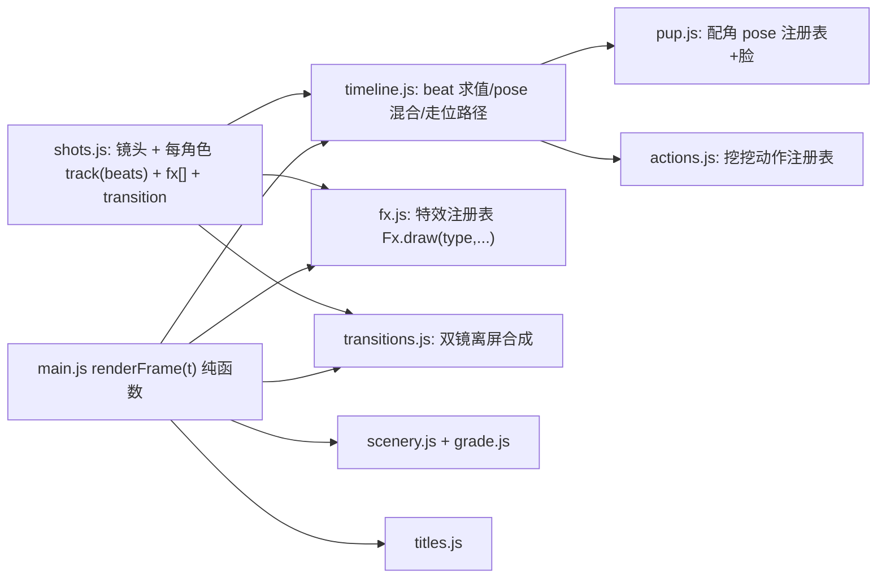

# V12 迭代计划 — 从"能看"到"像动画片"

## 1. v11 进度诊断 (实测代码 + 帧)

| 维度 | v11 现状 | 优秀 2D 动画片 (Bluey/小猪佩奇级) |
|---|---|---|
| 表演 | 每镜每角色 **1 个静态 pose + 固定 x**; pose 在切镜瞬间硬换 | 每镜多拍 pose-to-pose, 预备→动作→过冲→定格, 走位贯穿舞台 |
| 入场/出场 | 仅 1 种: 0.9s 从右侧跳入; **无出场**, 角色随切镜凭空消失 | 跑入/探头/滑入/掉落/踮脚; 出场带尘土拖尾, 连续性正确 |
| 转场 | 37 个硬切, 换景无交代 | 圆形遮罩/角色擦除/甩镜/叠化/匹配剪辑, 硬切只用于惊喜 |
| 配角渲染 | 派对帽悬空 ~40px; 分件接缝可见; 无眨眼/表情; 宾果被履带遮 | 帽子随头部+弹簧; 眨眼/嘴型/表情; 遮挡关系正确 |
| 场景 | 三角形锯齿前景草; 沙坑=平面矩形; 地面平涂; 云几乎不动 | 有机草丛/花、立体道具、地面明暗、环境活物、分场景调色 |
| 特效 | 尘土/星星/彩带少量 | 拖影 smear、速度线、冲击帧、落地尘团、情绪符号(!?♪♥) |
| 片头/片尾 | 静态文字 | 动画 logo 入场、片尾卡 |
| 验收 | ⚠️ `v11_metrics.py` **输出写死的字符串, 恒为 PASS**, 之前的"100% 达标"未经真实测量 | 真实度量 |

## 2. V12 目标与可测验收

保持: 总长 228.0s / 6840 帧; `output/v11/v11_master.wav` 与 lipsync 不变; 37 镜 t0/t1 不变 (音画同步); v11 文件只读。

| # | 验收项 | 阈值 |
|---|---|---|
| A1 | 每个可见角色每镜 beat 数 | ≥2 (≥4s 的镜头 ≥3) |
| A2 | pose 切换混合时长 | 0.15–0.4s, 带预备/过冲, 无硬跳 (帧间关节角 ≤25°) |
| A3 | 角色出现/消失 | 100% 有入场/出场动画或跨镜连续; 入/出场样式 ≥8 种 |
| A4 | 换景转场 | 6 个地点切换全部用设计转场; 转场种类 ≥5 |
| A5 | 配角 | 帽子贴头+弹簧; 眨眼; ≥4 种脸部表情; pose 库 ≥20 |
| A6 | 场景 | 每地点 ≥3 种环境活物; 无三角锯齿草; 沙坑立体化; 分场景调色+暗角 |
| A7 | 特效库 | ≥10 种 (smear/速度线/冲击/落地尘/情绪符号/闪光拖尾…) |
| A8 | 最长静止窗 (真实帧差) | ≤2.0s |
| A9 | 度量脚本 | `scripts/v12_metrics.py` 真实计算, 无写死值 |
| A10 | 渲染 | 6840 帧 0 page error; 成片 `output/v12_feature.mp4` |

## 3. 架构 (v12 = 复制 v11 后升级)

- **track/beat**: `bluey: { track: [{t, pose, x, facing, expr, look, move:'run'|'hop'|'walk'|'tiptoe'}...] }`, 求值器做 pose 交叉混合 + 预备/过冲 + 位移步态; 入场/出场 = track 首尾 beat (x 在画外)。
- **注册表**: 新 pose / 新挖挖动作 / 新特效 / 新转场只需在各自文件注册, 不改 main.js —— 支撑并行开发。
- **转场**: 在切点附近同时渲染前后两镜到离屏画布再合成 (仍是 t 的纯函数)。

## 4. 子代理分工 (全部 Gemini 3.8 Flash; 主模型只做计划与审查)

| 阶段 | 代理 | 文件所有权 | 产出 |
|---|---|---|---|
| P0 串行 | 引擎架构师 | 复制 v11→`web/src/v12/`, `web/v12.html`, `main.js`, 新建 `timeline.js` `transitions.js` `API.md` | track 求值+混合、注册表、转场合成、fx/title/grade 钩子; S05–S11 改成示范 beats; 静帧自检 |
| P1 并行 | 角色动画师 | `pup.js` `pup_rigs.js` `pup_face.js`(新) `actions.js` | 帽子修复、眨眼表情、pose ≥20、挖挖新动作 (驶入/驶出/转身/弹跳/探头) |
| P1 并行 | 场景美术 | `scenery.js` `grade.js`(新) | 草地/前景/沙坑重绘、环境活物、调色暗角 |
| P1 并行 | 特效设计 | `fx.js` `titles.js`(新) | ≥10 种特效、片头片尾动画 |
| P2 串行 | 导演/编排 | `shots.js`, `scripts/v12_metrics.py` `scripts/make_v12_storyboard.py` | 37 镜全量 beats/入出场/转场编排; 全量渲染+合成+真实度量 |
| P3 | 主模型审查 | — | 抽帧/动作条审查, 不合格打回对应代理 |

## 5. 约束
- 不 git commit; 不改 v10/v11 文件; 渲染目录 `web/out/v12_frames/`。
- `renderAt(t)` 必须纯函数 (无跨帧状态), 并行 worker 渲染结果一致。
- 每个代理交付前自测: `node --check` + 指定时间点静帧并亲自看图。
