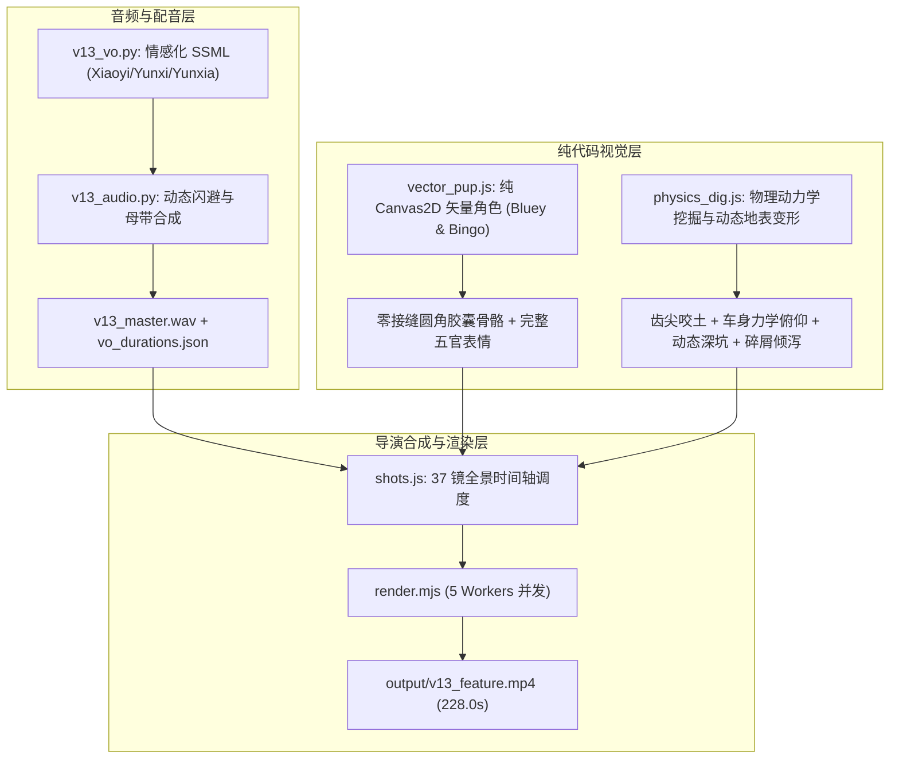

# V13 迭代规划 — 纯矢量角色重绘 · 物理真实挖掘 · 情感化少儿配音

## 1. 用户反馈直击与根因分析

| 问题点 | 根因诊断 | V13 彻底解决方案 |
|---|---|---|
| **布鲁伊关节/手臂有问题** | 原先使用位图 PNG 切片拼接旋转，旋转时圆角方形肢体必然产生断层、白边与接缝 | **废弃 PNG 抠图**，改用纯 Canvas2D 过程式矢量绘制（数学圆角胶囊肢体，肩/肘/髋/膝同色连续圆弧平滑融合，绝对零接缝） |
| **宾果抠图脸都不完整** | 原图素材本身被裁切或抠图算法吃掉了边缘，导致 Bingo 脸部破损缺失 | **纯代码重绘完整 1:1 原版 Bingo 脸部**（完整外轮廓、标志性左眼棕斑、饱满吻部、可爱大鼻子、灵动眼睛与双耳） |
| **配音没有合适的情绪** | 之前用默认平淡参数单调播报，缺乏少儿动画夸张欢快、起伏跌宕的戏剧表现力 | **引入情感化 SSML**：为 27 句台词针对性标注 `cheerful`、`excited`、`whispering`、`affectionate` 等少儿动画专业情绪与起伏重音 |
| **挖土不符合物理规律** | 只是大臂机械上下摆动，铲斗齿不咬入土层、无地面反作用力倾角、无斗内泥土堆积、无动态挖出凹坑与堆积土包 | **物理挖掘机力学仿真**：5 阶段真机动作（伸展入土→底盘前倾沉降→弧线拉刮破土+斗内填土→重载举升车身后仰→倾泻落土+重力重摔扬尘+地面真实下陷生成凹坑与土堆） |

---

## 2. 核心架构与模块拆分

---

## 3. 子代理团队分工 (全部采用 Gemini 3.8 Flash)

1. **子代理 A（纯代码矢量角色架构师）**:
   - 文件所有权：`web/src/v13/vector_pup.js`
   - 任务：彻底摆脱对 `assets/images/v11/pups/` PNG 切片的依赖。编写基于 Canvas2D 路径绘制的 100% 纯矢量 Bluey 与 Bingo 渲染器。
   - 包含：完整的头部、耳朵（含内耳）、标志性眼斑（Bluey 右眼深蓝斑，Bingo 左眼暖棕斑）、完整大鼻子吻部、张合嘴型、圆角方躯干、背部斑纹、动态卷尾巴、无缝旋转关节胶囊四肢、4 趾手爪与 3 趾脚掌。完美适配现有的 28 套动作库。

2. **子代理 B（挖掘机力学与土壤物理动画师）**:
   - 文件所有权：`web/src/v13/physics_dig.js`、`web/src/v13/actions.js`
   - 任务：重写 `dig` 物理动作与挖掘地面交互。
   - 包含：
     - 车身底盘动力学：下扎咬土时车身受反作用力前压倾斜 1.5°，重载提升时后座后仰 1.5°，发动机震颤；
     - 斗内土壤生成：铲斗卷起瞬间，铲斗内生成饱满立体的多层土壤土块模型；
     - 地表动态凹坑：斗齿刮过的区域，地面蒙版动态下凹形成深坑，并在侧旁堆积隆起新土堆；
     - 卸土物理粒子：倾倒时土块受重力抛物线下坠并产生尘土撞击效果。

3. **子代理 C（情感化少儿配音与音频专家）**:
   - 文件所有权：`scripts/v13_vo.py`、`scripts/v13_audio.py`
   - 任务：运用 edge-tts 高阶 SSML 技术为 27 句台词重配富含充沛情绪的儿童动画原声。
   - 包含：旁白选用活泼童趣的卡通音色，加入欢呼、惊喜、悄悄话等情绪修饰；挖挖选用阳光清脆男童音色；重新测算对齐时间戳并进行广播级母带立体声混音（-16.0 LUFS）。

4. **子代理 D（导演集成与全量渲染验收）**:
   - 文件所有权：`web/src/v13/main.js`、`web/src/v13/shots.js`、`web/v13.html`、`scripts/v13_metrics.py`、`scripts/make_v13_storyboard.py`
   - 任务：集成新矢量角色、新挖掘物理与新情感音频；使用 5 个并发 Worker 重新渲染全片 6840 帧并合成 `output/v13_feature.mp4`，生成 37 镜全景高清故事板并执行实机客观度量。
